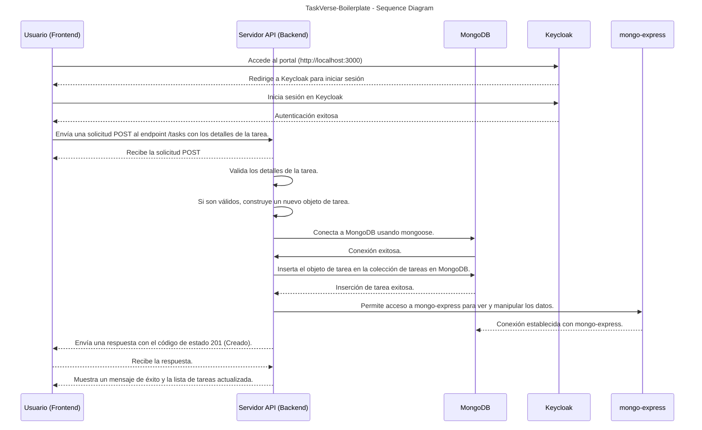
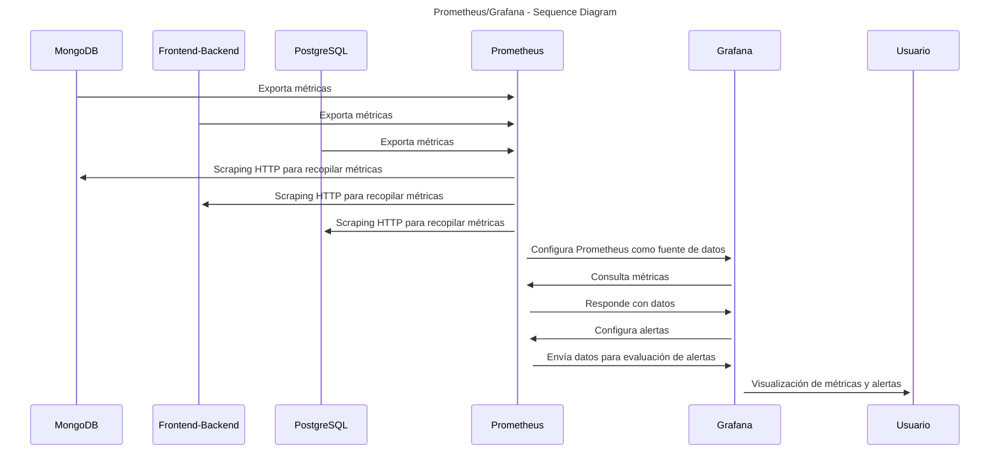

## TaskVerse-Boilerplate - CI/CD Implementation 

## Introducción y objetivos:
Con el objetivo de llevar a cabo todo lo aprendido durante este Bootcamp (DevOps - GeeksHubs Academy), se ha implementado esta aplicación de tareas llamada TaskVerse. En la que que he aplicado todos los conocimientos adquiridos durante este Bootcamp. Tanto conocimientos relacionados con el Backend como el Frontend. Además, se ha creado un diagrama de secuencia que muestra el flujo de la aplicación desde que se produce una interacción por parte del usuario introducciendo una tarea hasta que se registra en la base de datos. 

Aprovecho para agradecer tanto a mis compañeros del bootcamp como a los docentes de la GeeksHubs Academy. ❤

## Clonación: TaskVerse-Boilerplate
Para poder hacer uso del proyecto, simplemente debe clonar el repositorio de Github, y una vez clonado, al abrir el proyecto de manera automatica se ejecutará el script `update_all_dependencies.sh`. Gracias a las instrucciones que tenemos en el fichero de `tasks.json` de  `.vscode/tasks.json`. Este script actualiza todas las dependencias de la aplicación, cambiará los permisos y propietarios de algunos de los archivos, y posteriormente construirá la aplicación.

> [!IMPORTANT]
> Puede que durante la ejecucción de este script `update_all_dependencies.sh`, requiera de la contraseña del usuario `root`. ya que hay comandos que se ejecutan con `sudo`.


Para clonar el proyecto, se pueden usar los siguientes comandos:
```
git clone https://github.com/alexanderfarias/TaskVerse-Boilerplate.git
cd TaskVerse-Boilerplate
docker compose up --build -d
```
Una vez levando el proyecto, procederemos a ejecutar el script `update_all_dependencies.sh` para actualizar todas las dependencias de la aplicación. Hay que tener en cuenta que este script requiere de +x para poder ejecutarse.

```
cd TaskVerse-Boilerplate
chmod +x update_all_dependencies.sh
./update_all_dependencies.sh
```
## Criterios del proyecto.

- Se han cumplido los siguientes criterios para el proyecto:

- [X] La aplicación ha sido desarrollada con Node.js y ExpressJS.
- [X] Ofrece un sistema de integración continua (Haciendo uso del repositorio de Github)
- [X] La aplicación se encuentra dockerizada en diferentes contenedores necesarios para el funcionamiento de la aplicación (backend, frontend, base de datos, Keycloak, Grafana, Prometheus, etc).
- [X] Emplea el orquestrador docker-compose para la construcción de la aplicación.
- [X] Implementa un sistema automatizado de despliegue a través de pipelines con la herramienta Github Actions para construir, probar y desplegar la aplicación.
- [X] Incluye un panel de monitoreo de la aplicación gracias a la herramienta `[Prometheus](https://prometheus.io/)` (Recoge las metricas) junto con [Grafana](https://grafana.com/) (Visualiza los datos mediante Dashboards).
- [X] Es posible probar la aplicación en diferentes entornos (local, cloud, etc.).
- [x] Es posible configurar la base de datos y la autenticación para que funcione en diferentes entornos.

## Diagrama: TaskVerse-Boilerplate
Para poder ver mejor la secuencia de los pasos de la aplicación, he creado un diagrama de secuencia que muestra el flujo de la aplicación desde que el usuario introduce una tarea hasta que se registra en la base de datos. Pasando primero por la parte frontend donde el usuario introduce la tarea, y posteriormente por la parte backend donde se registra la tarea en la base de datos.

- [ ] En la parte Frontend, se ha desarrollado con [ReactJS](https://reactjs.org/) y desplegado con [Node Alpine](https://hub.docker.com/_/node), que es una imagen más ligera de node.
- [ ] En la parte Backend, se ha desarrollado con ExpressJS y desplegado con [Node Alpine](https://hub.docker.com/_/node), que es una imagen más ligera de node.
- [ ] La base de datos se ha desplegado con [MongoDB](https://www.mongodb.com/es) y se ha conectado con la librería [mongoose](https://mongoosejs.com/). La cual nos permite gestionar la persistencia de datos.
- [ ] Se ha configurado Keycloak como sistema de autenticación al acceder al portal (http://localhost:3000), primero redirige la petición a Keycloak para iniciar sesión y posteriormente a la aplicación.


## Estructura: TaskVerse-Boilerplate

Para ello, hemos definido la siguiente estructura de carpetas y archivos: 

```
.TaskVerse-Boilerplate
├── README.md
├── backend
│   ├── Dockerfile
│   ├── models
│   ├── node_modules
│   ├── package-lock.json
│   ├── package.json
│   ├── routes
│   └── server.js
├── docker-compose.yml
├── frontend
│   ├── Dockerfile
│   ├── README.md
│   ├── build
│   ├── node_modules
│   ├── package-lock.json
│   ├── package.json
│   ├── public
│   └── src
├── prometheus
│   └── prometheus.yml
└── update_all_dependencies.sh
```
# Uso de Prometheus y Grafana

La instalación de estas dos aplicaciones se han llevado a cabo en el nuestro archivo de `docker-compose.yml`. En ella se ha definido tanto la configuración de Prometheus como la de Grafana.

En este diagrama de secuencia se muestra el funcionamiento del panel de monitoreo de la aplicación (Prometheus y Grafana). 




Para poder recoger las métricas necesarias para el monitoreo de las mismas, se han configurado los contenedores: `postgres-exporter`, `mongo_exporter`, `node_exporter`, `snmp_exporter`.

Estos exportadores de métricas nos permiten recopilar los datos de las diferentes aplicaciones que tenemos en nuestra aplicación y mostrarlas posteriormente en Grafana.

> [!NOTE]
> A continuación se muestra una imagen de la configuración de Prometheus. Y de las métricas recopiladas.

