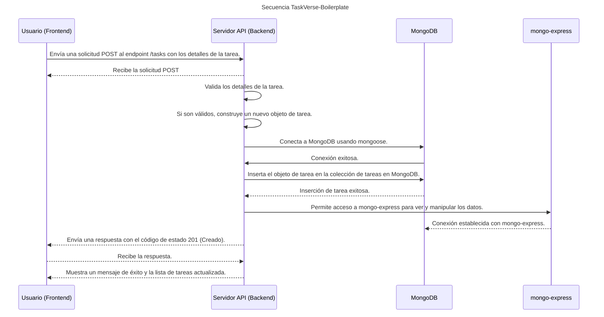

TaskVerse-Boilerplate - Tasks Application - CI/CD Implementation for automated testing and deployment

Se trata de una implementación de CI/CD para automatizar las pruebas y el despliegue de mi aplicación la cual permite al usuario interactuar con la aplicación creando tareas y registrandolas en una base de datos MongoDB con la librería [mongoose](https://mongoosejs.com/) que se encarga de la persistencia de los datos. 


---
## Diagrama de secuencia
Para poder ver mejor la secuencia de los pasos de la aplicación, he creado un diagrama de secuencia que muestra el flujo de la aplicación desde que el usuario introduce una tarea hasta que se registra en la base de datos. Pasando primero por la parte frontend donde el usuario introduce la tarea, y posteriormente por la parte backend donde se registra la tarea en la base de datos.

- [ ] En la parte Frontend, se ha desarrollado con [ReactJS](https://reactjs.org/) y desplegado con [Node Alpine](https://hub.docker.com/_/node), que es una imagen más ligera de node.
- [ ] En la parte Backend, se ha desarrollado con ExpressJS y desplegado con [Node Alpine](https://hub.docker.com/_/node), que es una imagen más ligera de node.
- [ ] La base de datos se ha desplegado con [MongoDB](https://www.mongodb.com/es) y se ha conectado con la librería [mongoose](https://mongoosejs.com/).


---

## Estructura de directorios.

Para ello, hemos definido la siguiente estructura de carpetas y archivos: 

```
TaskVerse-Boilerplate
├── README.md
├── backend
│   ├── Dockerfile
│   ├── models
│   │   └── todo.js
│   ├── package-lock.json
│   ├── package.json
│   ├── routes
│   │   ├── index.js
│   │   └── todos.js
│   └── server.js
├── docker-compose.yml
└── frontend
    ├── Dockerfile
    ├── README.md
    ├── package-lock.json
    ├── package.json
    ├── public
    │   ├── favicon.ico
    │   ├── index.html
    │   ├── logo192.png
    │   ├── logo512.png
    │   ├── manifest.json
    │   └── robots.txt
    └── src
        ├── App.css
        ├── App.jsx
        ├── App.test.js
        ├── components
        │   ├── home.jsx
        │   ├── login.jsx
        │   └── todo-form.jsx
        ├── index.css
        ├── index.js
        ├── logo.svg
        ├── reportWebVitals.js
        └── setupTests.js
```

---
## Descripción
A demonstration of Docker to implement a simple 3 tier architecture

* frontend will be able to access the mid-tier
* mid-tier will be able to access the db

In order to run this in docker, simply type ```docker-compose up``` at the command prompt. Docker will then create the [MongoDB](https://www.mongodb.com/) from the stock [mongo](https://hub.docker.com/_/mongo) image. The api uses [nodejs](https://nodejs.org/) with [express](http://expressjs.com/) and is built from a [node:alpine](https://hub.docker.com/_/node) image. The front end uses [ReactJS](https://reactjs.org/) and built from a [node:alpine](https://hub.docker.com/_/node) image.